# Experiments: 3D Conway's Game of Life

This document describes three experiments conducted on a 3D implementation of Conway's Game of Life, exploring both random and predefined initial states.

## Rules Used
- **Birth Rule**: A dead cell becomes alive if it has exactly 4 alive neighbors.
- **Survival Rule**: A live cell stays alive if it has 5 to 6 alive neighbors.
- **Death Rule**: All other cells become or remain dead.

## Experiment 1: Random Initial State
### Initial Setup
- **Grid Size**: 10 × 10 × 10 (1000 cells total)
- **Initial State**: Randomly seeded with 53 alive cells and 947 dead cells

### Generations Overview
1. **Initial State**:
   - **Alive Cells**: 53
   - **Dead Cells**: 947
   
   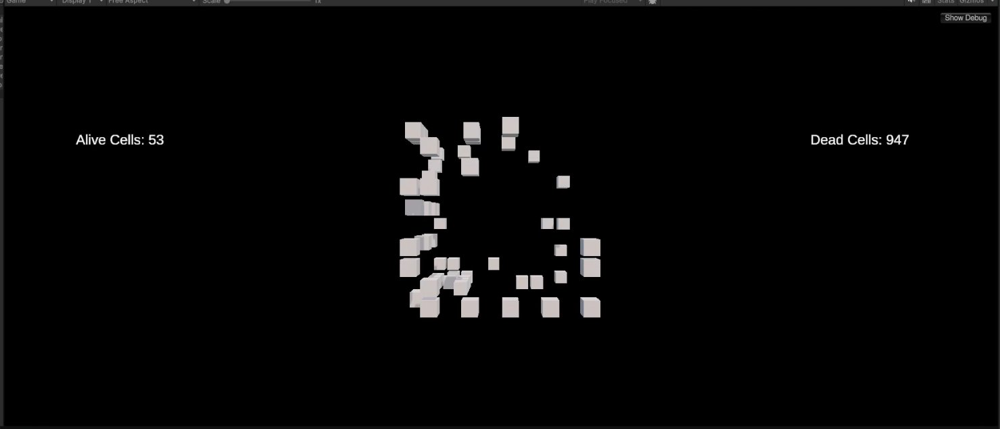

2. **Generation 2**:
   - **Alive Cells**: 12
   - **Dead Cells**: 988
   
   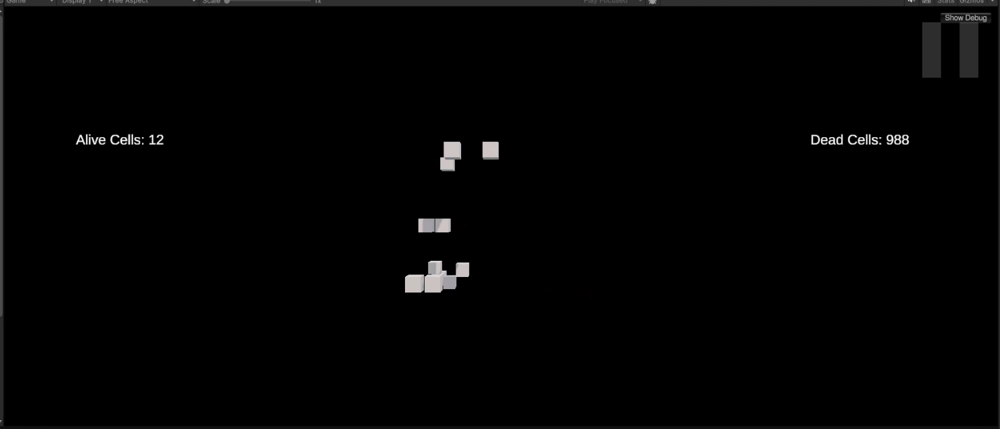

3. **Generation 3**:
   - **Alive Cells**: 4
   - **Dead Cells**: 996
   
   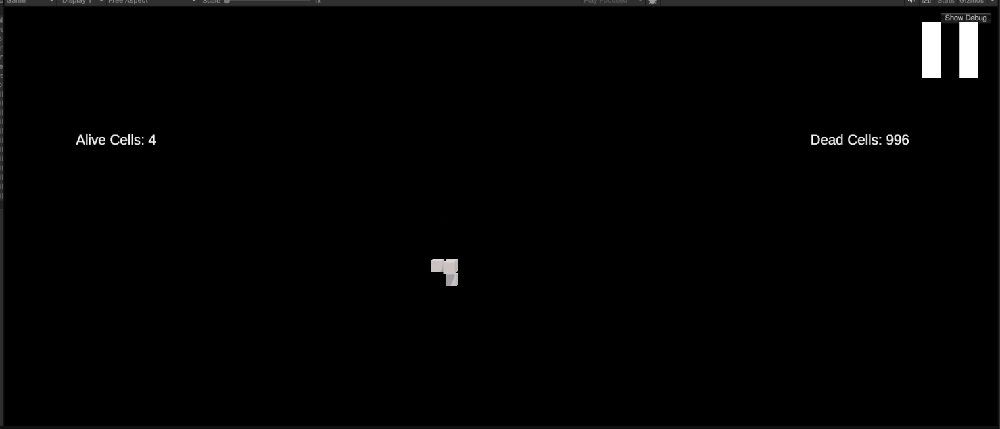

4. **Generation 4**:
   - **Alive Cells**: 4
   - **Dead Cells**: 996
   
   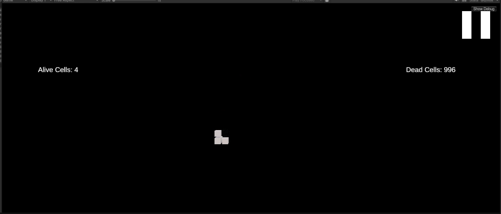

5. **Steady Oscillation**:
   - After Generation 4, the system oscillates between Generation 3 and Generation 4
   
   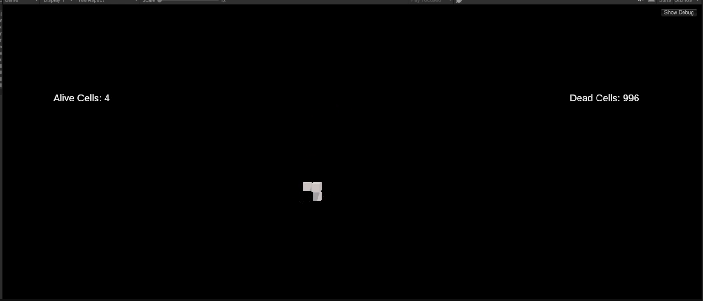

### Analysis
1. **Rapid Decline**:
   - Sharp decrease in alive cells in first few generations
   - Sparse initial seeding led to quick population reduction

2. **Stabilization**:
   - System stabilized into periodic oscillation
   - Maintained consistent cell count in oscillating state

## Experiment 2: Predefined Initial State - Oscillating Pattern
### Initial Setup
- **Grid Size**: 10 × 10 × 10 (1000 cells total)
- **Initial State**: Predefined pattern with specific cell configurations

### Initial Pattern Configuration
## Pattern Files
Initial patterns can be found in the [/Patterns](/GameOfLife3D/Assests/Patterns) directory:
- [oscillator.txt](/Patterns/stable_oscillator.txt)

### Generations Overview
1. **Initial State**:
   - **Alive Cells**: 11
   - **Dead Cells**: 989
   
   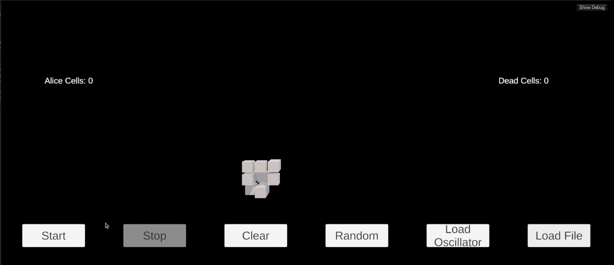

2. **Generation 2**:
   - **Alive Cells**: 11
   - **Dead Cells**: 989
   
   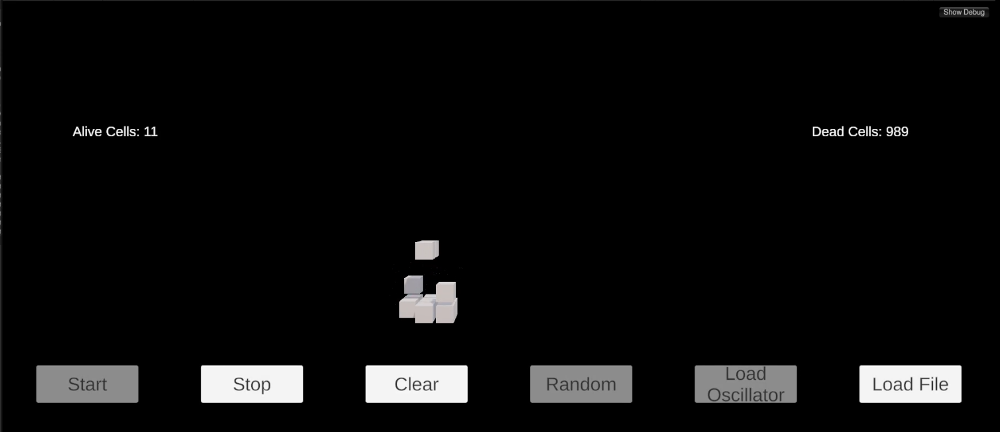

3. **Generation 3**:
   - **Alive Cells**: 5
   - **Dead Cells**: 995
   
   

4. **Generation 4**:
   - **Alive Cells**: 5
   - **Dead Cells**: 995
   
   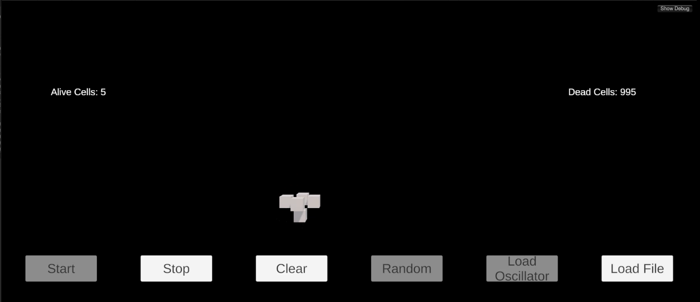

5. **Steady Oscillation**:
   - After Generation 4, the system oscillates between Generation 3 and Generation 4
   
   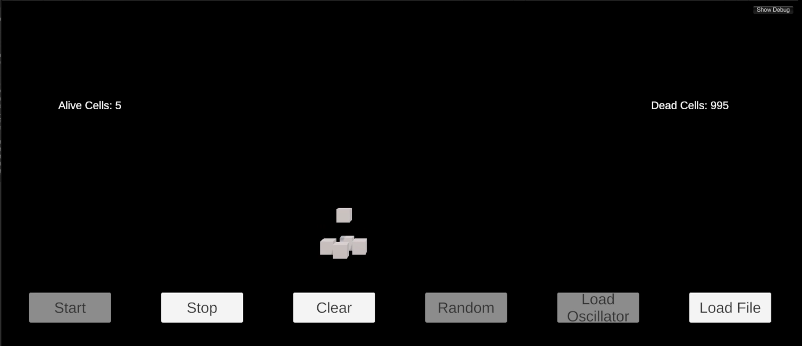

### Analysis
1. **Pattern Evolution**:
   - Predictable evolution from initial state
   - Maintained structural coherence

2. **Stability**:
   - Quick stabilization into oscillating pattern
   - Consistent behavior after stabilization

## Experiment 3: Cross Pattern Evolution
### Initial Setup
- **Grid Size**: 10 × 10 × 10 (1000 cells total)
- **Initial State**: Predefined cross pattern configuration

### Initial Cross Pattern Configuration

## Pattern Files
Initial patterns can be found in the [/Patterns](/GameOfLife3D/Assests/Patterns) directory:
- [cross_pattern.txt](/Patterns/cross_pattern.txt)

### Generations Overview
1. **Initial State**:
   - **Alive Cells**: 15
   - **Dead Cells**: 985
   
   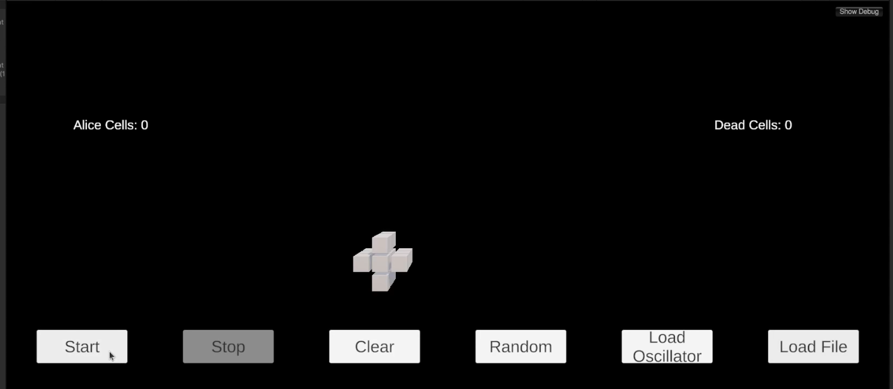

2. **Generation 2**:
   - **Alive Cells**: 4
   - **Dead Cells**: 996
   
   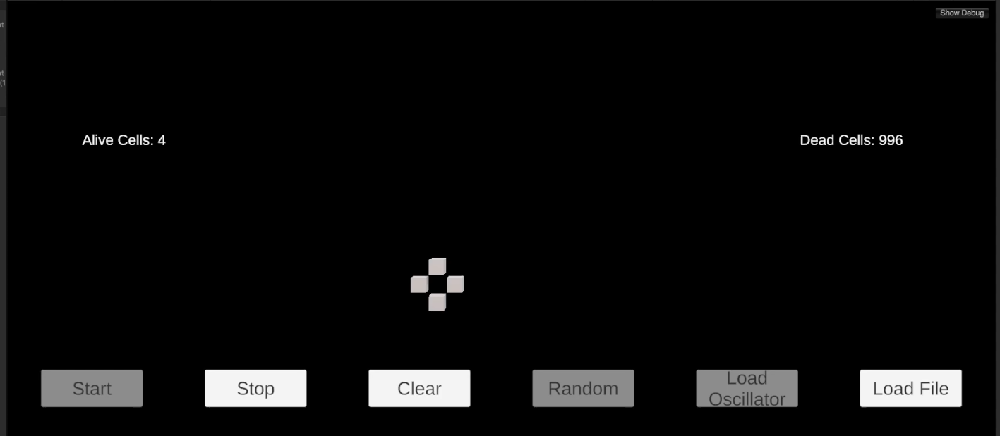

3. **Generation 3**:
   - **Alive Cells**: 3
   - **Dead Cells**: 997
   
   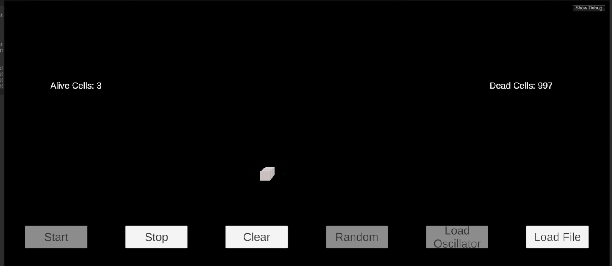

4. **Generation 4**:
   - After Generation 3, the system oscillates between Generation 3 and Generation 4
   - **Alive Cells**: 0
   - **Dead Cells**: 1000
   
   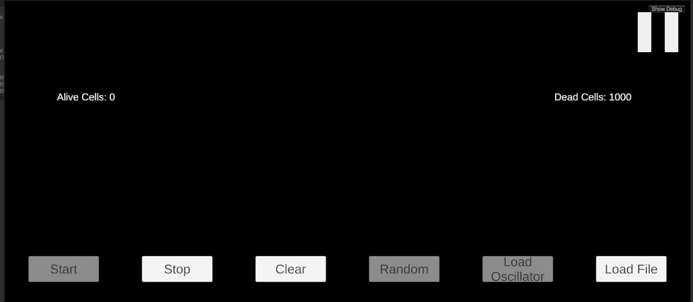

### Analysis
1. **Pattern Evolution**:
   - Finite lifespan of 3 generations
   - Systematic decay pattern
   - Preserved symmetry during decay

## Comparative Analysis
### Pattern Longevity
1. **Random Initial State**:
   - Achieved stable oscillation
   - Indefinite survival through oscillation

2. **First Predefined Pattern**:
   - Stable oscillation between two states
   - Maintained structural integrity

3. **Cross Pattern**:
   - Limited lifespan
   - Complete extinction after 3 generations

### Behavioral Characteristics
1. **Random Pattern**:
   - Unpredictable initial evolution
   - Eventually stabilized

2. **First Predefined Pattern**:
   - Predictable evolution
   - Consistent oscillation

3. **Cross Pattern**:
   - Predictable decay
   - Symmetric dissolution

## Conclusions
1. **Initial Configuration Impact**:
   - Determines pattern longevity
   - Influences stability characteristics
   - Affects evolutionary predictability

2. **Pattern Behavior**:
   - Symmetric patterns maintain symmetry during evolution
   - Different initial states lead to distinct outcomes
   - System tends toward either oscillation or extinction

3. **System Characteristics**:
   - Strong tendency toward oscillation or extinction
   - Strict rules create challenging survival conditions
   - Pattern symmetry influences evolution

## Future Research Directions
1. **Pattern Design**:
   - Explore more symmetric configurations
   - Study relationship between symmetry and longevity
   - Investigate hybrid pattern designs

2. **Rule Modifications**:
   - Test variations in neighbor thresholds
   - Explore different survival conditions
   - Study impact of rule modifications

3. **Analysis Methods**:
   - Develop pattern prediction tools
   - Study long-term behavior patterns
   - Analyze pattern transformation mechanics

---

Prepared as part of the 3D Conway's Game of Life Project.
