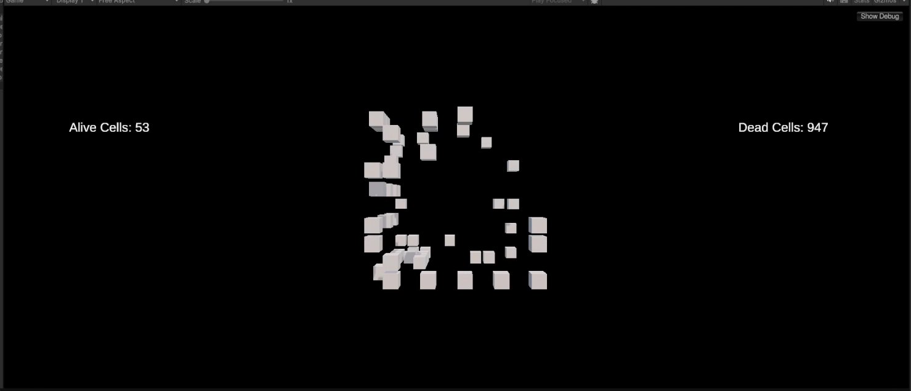
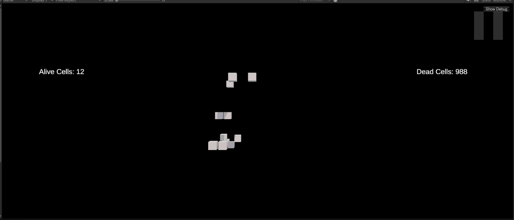
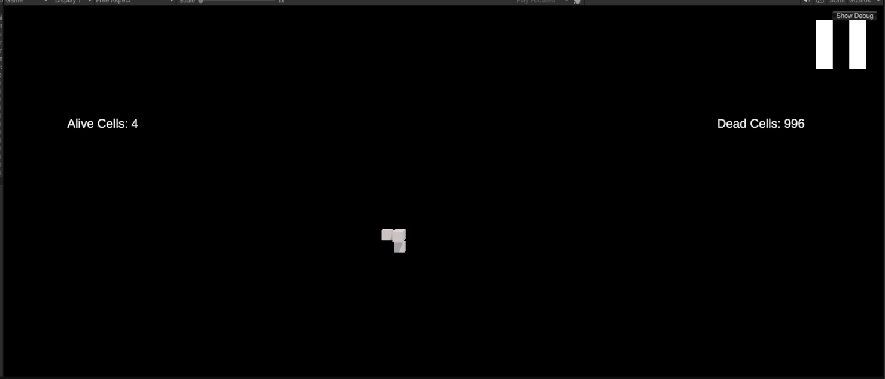
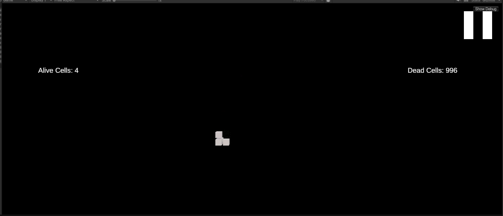
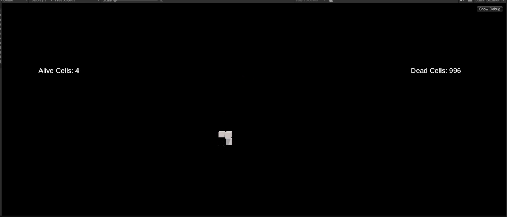

# Experiment: 3D Conway's Game of Life

This document describes an experiment conducted on a 3D implementation of Conway's Game of Life. The results of the simulation, based on a random initial state, are detailed below along with observations.

## Initial Setup
- **Grid Size**: \(10 	times 10 	times 10\) (1000 cells total).
- **Initial State**: Randomly seeded with 53 alive cells and 947 dead cells.

## Rules Used
- **Birth Rule**: A dead cell becomes alive if it has exactly 4 alive neighbors.
- **Survival Rule**: A live cell stays alive if it has 5 to 6 alive neighbors.
- **Death Rule**: All other cells become or remain dead.

## Observations
The experiment began with the random seeding of the grid. The simulation was run for several generations. Here are the results:

### Generations Overview
1. **Initial State**:
   - **Alive Cells**: 53
   - **Dead Cells**: 947
   
   

2. **Generation 2**:
   - **Alive Cells**: 12
   - **Dead Cells**: 988
   
   

3. **Generation 3**:
   - **Alive Cells**: 4
   - **Dead Cells**: 996
   
   

4. **Generation 4**:
   - **Alive Cells**: 4
   - **Dead Cells**: 996
   
   

5. **Steady Oscillation**:
   - After Generation 4, the system oscillates between Generation 3 and Generation 4, with the state fluctuating without significant changes in the number of alive cells.
   
   

## Analysis
1. **Rapid Decline**:
   - The number of alive cells sharply decreased in the first few generations, likely due to sparse initial seeding and strict survival rules.

2. **Stabilization**:
   - After reaching a low count, the system stabilized into a periodic oscillation between two states with 3 and 4 alive cells.

3. **Patterns**:
   - The surviving cells form small, isolated clusters that cannot grow or interact significantly due to the surrounding dead cells and lack of neighbors.

## Conclusions
- The observed dynamics suggest that the initial density of alive cells significantly impacts the long-term behavior of the system.
- Rule sets for 3D Conway's Game of Life may require fine-tuning to achieve sustained growth or diverse patterns.
- Further experiments with higher initial densities or different rules could yield more varied and interesting results.

## Suggestions for Future Experiments
- **Increase Initial Density**: Use 20-30% alive cells in the initial state.
- **Test Alternative Rules**: Experiment with less strict survival and birth conditions.
- **Boundary Conditions**: Consider toroidal wrapping to allow patterns to interact across edges.

---

Prepared as part of the 3D Conway's Game of Life Project.

